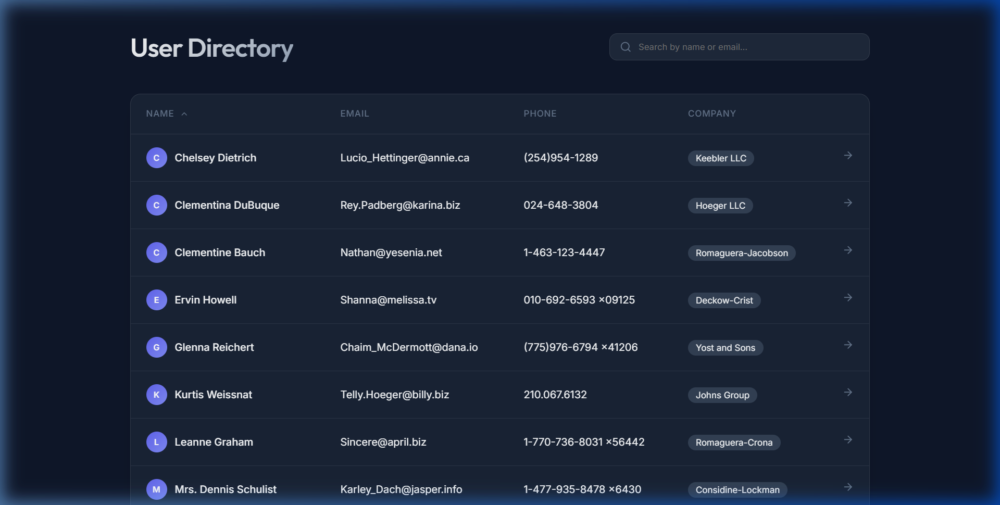
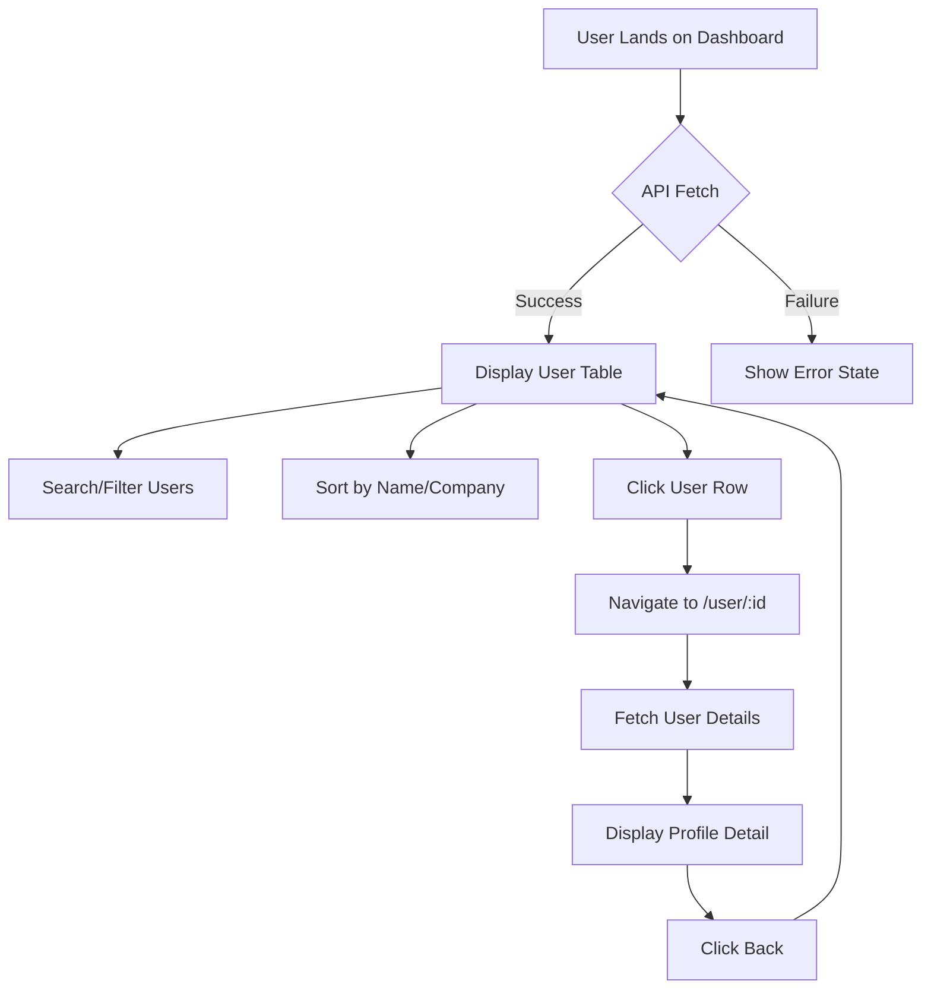
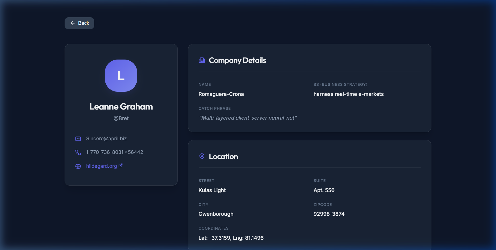

# User Directory Dashboard

A premium, high-performance User Directory Dashboard built with **React**, **Vite**, and **Vanilla CSS**. This application provides a seamless experience for browsing and managing user data from the JSONPlaceholder API.



## 🚀 Features

- **Premium UI/UX**: Modern dark-themed design with glassmorphism effects and smooth transitions.
- **Dynamic Search**: Instant client-side filtering by user Name or Email.
- **Intelligent Sorting**: Multi-column sorting (Name, Company) with ascending and descending support.
- **Detailed Profiles**: Rich user profile pages displaying company information and geographic location.
- **Animated Interactions**: Powered by `framer-motion` for a professional, "app-like" feel.

## 🛠️ Technology Stack

- **Framework**: React 18+
- **Build Tool**: Vite
- **Styling**: Vanilla CSS (Modern CSS Variables & Flexbox/Grid)
- **Animations**: Framer Motion
- **Icons**: Lucide React
- **Routing**: React Router DOM v6

## 📈 Application Workflow



## 📸 Screenshots

### User Detail Page


## 📦 Getting Started

### Prerequisites
- Node.js (v16+)
- npm or yarn

### Installation
1. Clone the repository:
   ```bash
   git clone https://github.com/CodeSculpt-RG/Dashboard.git
   ```
2. Navigate to the project directory:
   ```bash
   cd Dashboard
   ```
3. Install dependencies:
   ```bash
   npm install
   ```
4. Start the development server:
   ```bash
   npm run dev
   ```

## 📂 Project Structure
```text
src/
├── components/   # Atomic UI components
├── hooks/        # Custom React hooks
├── pages/        # Main route components (Dashboard, UserDetail)
├── services/     # API service layer (JSONPlaceholder)
├── styles/       # Global CSS and themes
├── App.jsx       # Route definitions
└── main.jsx      # Application entry point
```
